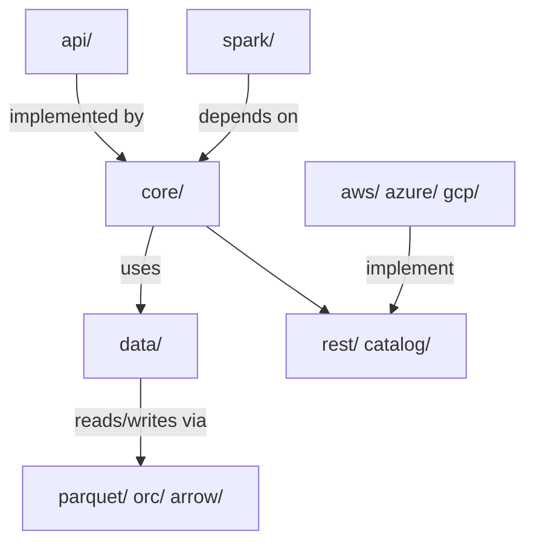
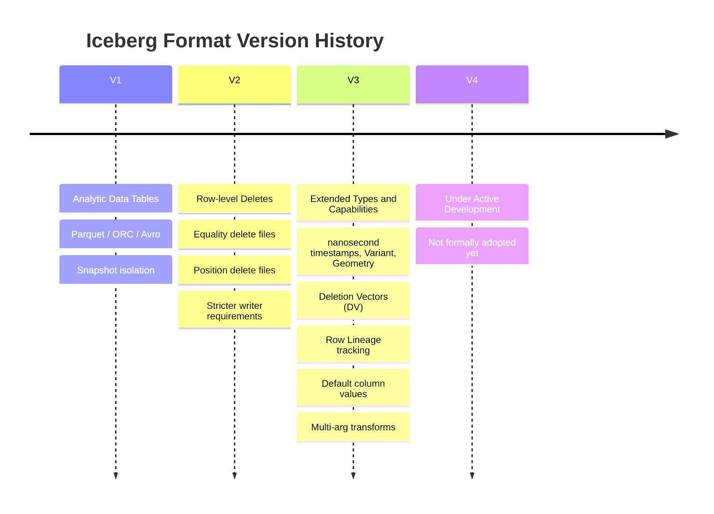
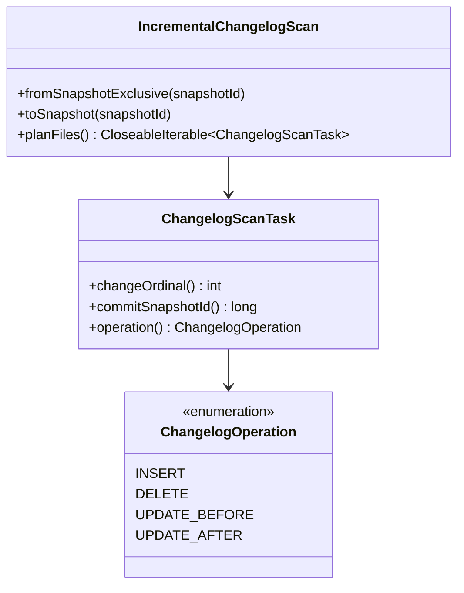
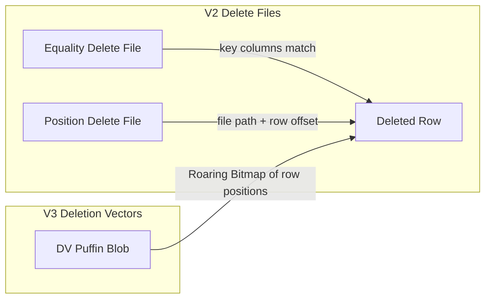
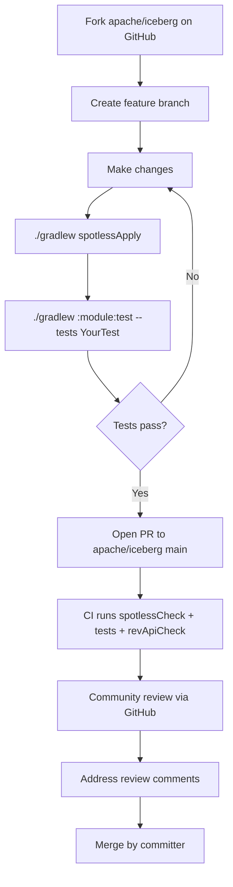

<!--
  Licensed to the Apache Software Foundation (ASF) under one
  or more contributor license agreements.  See the NOTICE file
  distributed with this work for additional information
  regarding copyright ownership.  The ASF licenses this file
  to you under the Apache License, Version 2.0 (the
  "License"); you may not use this file except in compliance
  with the License.  You may obtain a copy of the License at

    http://www.apache.org/licenses/LICENSE-2.0

  Unless required by applicable law or agreed to in writing,
  software distributed under the License is distributed on an
  "AS IS" BASIS, WITHOUT WARRANTIES OR CONDITIONS OF ANY
  KIND, either express or implied.  See the License for the
  specific language governing permissions and limitations
  under the License.
-->

# Apache Iceberg Contributor's Deep Dive

> A guide for experienced table-format engineers getting oriented in the Iceberg Java codebase.

---

## 1. Repository Structure

```
iceberg/
├── api/            ← Public Java interfaces (Table, Scan, Schema, PartitionSpec…)
├── core/           ← Spec implementation — the heart of Iceberg
├── data/           ← Generic data layer (readers / writers, DeleteFilter)
├── parquet/        ← Parquet reader / writer integration
├── orc/            ← ORC reader / writer integration
├── arrow/          ← Arrow / vectorized reader integration
├── spark/          ← Apache Spark integration (v3.4, v3.5, v4.0, v4.1)
├── open-api/       ← OpenAPI spec for the REST Catalog (IRC)
├── aws/            ← AWS-specific catalog + S3FileIO
├── azure/          ← Azure ADLS catalog + ADLSFileIO
├── gcp/            ← GCS catalog + GCSFileIO
├── nessie/         ← Nessie catalog
├── hive-metastore/ ← Hive Metastore catalog
├── kafka-connect/  ← Kafka Connect sink
├── format/         ← The canonical Iceberg spec markdown (spec.md, puffin-spec.md …)
└── docs/           ← Website source
```

### 1.1 Key Layer Boundaries



**`api/`** has the strongest stability guarantees — breaking changes are never allowed. Every other engine and catalog depends on it. New interface methods must always include a default implementation.

**`core/`** implements the table spec. It must remain engine-agnostic. No Spark or Flink imports live here. Everything from snapshot production (`MergingSnapshotProducer`) to manifest reading (`ManifestGroup`) to scan planning (`SnapshotScan`) to delete file handling (`deletes/`) lives here.

### 1.2 Core sub-packages

| Package | What lives there |
|---|---|
| `core/…/iceberg` | `TableMetadata`, `MergingSnapshotProducer`, scan implementations |
| `core/…/deletes` | DV writer, equality/position delete writers, `RoaringPositionBitmap` |
| `core/…/puffin` | Statistics / index files (Puffin format) |
| `core/…/rest` | REST catalog client |
| `core/…/expressions` | Predicate expression tree + evaluators |
| `core/…/io` | `FileIO` abstraction, `CloseableIterable`, task writers |
| `core/…/variants` | Variant type support (V3+) |
| `core/…/encryption` | Table encryption key management |
| `core/…/metrics` | Scan / commit metrics reporting |

### 1.3 Spark module layout

```
spark/
├── v3.4/  ← Spark 3.4
├── v3.5/  ← Spark 3.5
├── v4.0/  ← Spark 4.0
└── v4.1/  ← Spark 4.1
    └── spark/src/main/java/…/spark/
        ├── source/   ← DataSourceV2 table, reader, writer
        ├── actions/  ← RewriteDataFiles, ExpireSnapshots, RewriteManifests …
        ├── procedures/ ← SQL stored procedures (CALL iceberg.system.…)
        └── functions/  ← SQL scalar functions (bucket, truncate, …)
```

---

## 2. Local Development

### 2.1 Prerequisites

| Tool | Version |
|---|---|
| JDK | 11 or 17 (17 recommended) |
| Gradle | Wrapper included (`./gradlew`), no install needed |
| Docker (optional) | For REST catalog integration tests |

No Maven. No IDE plugins required. The standard workflow is:

```bash
# Clone and build (skip all tests for a fast first build)
./gradlew build -x test -x integrationTest

# Format code before committing (Spotless is enforced by CI)
./gradlew spotlessApply

# Check formatting only
./gradlew spotlessCheck

# Check API compatibility (revapi tracks breaking changes)
./gradlew revApiCheck
```

### 2.2 Running Tests

Tests are per-module and use JUnit 5 + AssertJ. **All Spark tests use an embedded in-process Spark session (`.master("local[2]")`). You do not need a running Spark cluster.** Spark is a normal library dependency that spins up in the JVM during the test.

There are two distinct test types in the Spark module:

| Task | What it tests | How to run |
|---|---|---|
| `test` | Compiled project classes. Fast, most of the test suite. | `./gradlew :iceberg-spark:iceberg-spark-4.1_2.13:test` |
| `integrationTest` | The **shadow JAR** (the shaded runtime artifact users actually ship). Validates that the packaged JAR works correctly with Spark, catching shading/relocation bugs. | `./gradlew :iceberg-spark:iceberg-spark-4.1_2.13-runtime:integrationTest` |

The `integrationTest` task is important because shading can accidentally relocate or duplicate classes. It runs the same embedded Spark session but loads the runtime JAR from the classpath instead of project classes.

```bash
# Run a single test class in core
./gradlew :iceberg-core:test --tests org.apache.iceberg.TestTableMetadata

# Run a single test method
./gradlew :iceberg-core:test --tests "org.apache.iceberg.TestTableMetadata.testJsonSerialization"

# Run Spark tests (module name includes Spark + Scala version)
./gradlew :iceberg-spark:iceberg-spark-4.0_2.13:test \
  --tests "org.apache.iceberg.spark.source.TestSparkReaderDeletes"

# Run all Spark streaming tests
./gradlew :iceberg-spark:iceberg-spark-4.1_2.13:test \
  --tests "org.apache.iceberg.spark.source.TestStructuredStreamingRead3"
```

### 2.3 Project Conventions Cheat-Sheet

```java
// ✅ Correct — no Jackson annotations, use custom parsers
class MyMetadataParser {
  static void toJson(MyMetadata meta, JsonGenerator generator) { … }
  static MyMetadata fromJson(JsonNode node) { … }
}

// ✅ Correct — null over Optional, Preconditions first
public MyObject create(String name, Schema schema) {
  Preconditions.checkNotNull(name, "Name cannot be null");
  Preconditions.checkNotNull(schema, "Schema cannot be null");
  …
}

// ✅ Correct — CloseableIterable, not Stream
try (CloseableIterable<FileScanTask> tasks = scan.planFiles()) {
  for (FileScanTask task : tasks) { … }
}

// ✅ Correct — kebab-case JSON keys
{"format-version": 2, "table-uuid": "...", "last-updated-ms": 1234}
```

---

## 3. Areas of Deep Interest

### 3.1 Spec Version Roadmap



### 3.2 CDC / Changelog

The changelog machinery is already built into the API layer. The core abstraction is an **incremental scan** that returns change events between two snapshots.



Key files:
- `api/…/IncrementalChangelogScan.java` — the top-level scan API
- `api/…/ChangelogScanTask.java` — one scan task (maps to a file slice)
- `core/…/ChangelogUtil.java` — helper logic
- Open PR #10935 — **Changelog scan support for tables with delete files** (long-running, this is hard)

**SCD Type 2 / Upsert** — Iceberg itself is append-only + deletes. SCD-2 is implemented at the engine layer (Spark `MERGE INTO`, other engines do the same) on top of Iceberg's V2 delete machinery. Iceberg doesn't natively track "current version" rows — that logic must live in the writer.

### 3.3 Delete Files and Deletion Vectors (V3)



Deletion Vectors (DVs) are the V3 evolution of position deletes. A DV is stored as a Puffin blob using a `RoaringBitmap` and replaces multiple small position delete files per data file with a single compact bitmap.

Key files:
- `core/…/deletes/DVFileWriter.java` — DV writer interface
- `core/…/deletes/BitmapPositionDeleteIndex.java` — bitmap-backed index
- `core/…/deletes/RoaringPositionBitmap.java` — the bitmap itself
- `core/…/puffin/` — Puffin container for statistics and DV blobs

### 3.4 Puffin — Statistics / Indexing Files

Puffin is Iceberg's container format for auxiliary data: column statistics (NDV sketches, histograms) and deletion vectors. Think of it as a sidecar file format.

```
Puffin File Layout:
┌─────────────┬─────────────┬─── … ───┬───────────────┬──────────┐
│ Magic bytes │  Blob 1     │ Blob N  │ Footer (JSON) │ Magic    │
│ (4 bytes)   │  (raw bytes)│         │ + footer size │ (4 bytes)│
└─────────────┴─────────────┴─── … ───┴───────────────┴──────────┘
```

- `core/…/puffin/Puffin.java` — read/write builder
- `core/…/puffin/PuffinFormat.java` — compression/decompression (has live LZ4 bug — see §7)
- `core/…/puffin/StandardBlobTypes.java` — registered blob type names (`apache-datasketches-theta-v1`, `deletion-vector-v1`)
- `format/puffin-spec.md` — the canonical spec

### 3.5 Format V4 — What's Coming

V4 is **under active development and not yet formally adopted** (per `format/spec.md` line 29). No public release has included V4 tables. V4 work to watch:

- **Catalog transactions** — PR #6948 (very long-running): atomic multi-table operations
- **Geometry / Geography** — PR #12347: adding spatial types to the spec
- **Scan planning APIs on REST** — PR #11180: pushing planning server-side
- **File Format API unification** — PR #12216

Keep an eye on the `format/spec.md` Appendix E section for the formal V4 changelog as it solidifies.

---

## 4. Streaming with Iceberg (Spark Structured Streaming)

### 4.1 Class Hierarchy

Iceberg implements Spark's DataSourceV2 `MicroBatchStream` interface. The key classes in `spark/v4.x/spark/src/main/java/…/spark/source/`:

```
SparkTable
└─ capabilities(): {BATCH_READ, MICRO_BATCH_READ, BATCH_WRITE, STREAMING_WRITE, …}
   └─ newScanBuilder(options)
      └─ SparkScanBuilder.build()
         └─ SparkMicroBatchStream   ← the MicroBatchStream impl
            ├─ initialOffset()      ← persisted in checkpoint/offsets/0
            ├─ latestOffset()       ← called every trigger by Spark driver
            ├─ planInputPartitions() ← called between offsets, returns FileScanTask groups
            └─ commit(end)          ← called after executor batch completes
               │
               └─ BaseSparkMicroBatchPlanner   ← decides what to read
                  ├─ SyncSparkMicroBatchPlanner    ← default: plan inline on driver
                  └─ AsyncSparkMicroBatchPlanner   ← opt-in: background thread pre-fetches manifests
```

`SparkMicroBatchStream` delegates all scan planning to the planner. The planner walks the snapshot log from `startOffset` to `endOffset`, calling `shouldProcess(snapshot)` for each snapshot it encounters.

### 4.2 Offset Tracking

`StreamingOffset` is serialized into Spark's checkpoint directory (e.g., `hdfs://…/checkpoint/offsets/0`):

```json
{"version": 1, "snapshot_id": 8765432198765432, "position": 3, "scan_all_files": false}
```

| Field | Meaning |
|---|---|
| `snapshot_id` | The last snapshot fully processed |
| `position` | Index of the last `FileScanTask` consumed within that snapshot |
| `scan_all_files` | `true` on the very first batch (scan all existing files, not just added ones) |

**Important:** `StreamingOffset` does NOT encode the branch name. If you run two streams on different branches of the same table and they share a checkpoint location, their offsets are ambiguous. Avoid sharing checkpoint locations across branches.

### 4.3 Sync vs Async Planner

| Planner | Trigger | When to use |
|---|---|---|
| `SyncSparkMicroBatchPlanner` (default) | Plans manifest files synchronously on driver during `latestOffset()` | Low-latency tables with infrequent snapshots |
| `AsyncSparkMicroBatchPlanner` | Background thread pre-fetches manifest entries into a bounded queue | Tables with many small files per snapshot; high-throughput ingest |

Enable async: `option("streaming-planner-type", "async")`. The async planner uses a `LinkedBlockingDeque` and a `ScheduledExecutorService`; errors from the background thread surface on the next `latestOffset()` call.

### 4.4 Why Tables with Deletes/Updates Cannot Be Streaming Sources

This is the most-asked question about Iceberg streaming. The short answer: **the current `SparkMicroBatchStream` is fundamentally append-only at the snapshot level.** Here is exactly why.

`BaseSparkMicroBatchPlanner.shouldProcess(snapshot)` is the gating function:

```java
// BaseSparkMicroBatchPlanner.java
protected boolean shouldProcess(Snapshot snapshot) {
  switch (snapshot.operation()) {
    case DataOperations.APPEND:   return true;   // ✅ new rows added
    case DataOperations.REPLACE:  return false;  // skip (compaction, no net row change)
    case DataOperations.DELETE:
      Preconditions.checkState(
          readConf.streamingSkipDeleteSnapshots(),
          "Cannot process delete snapshot: %s, …", snapshot.snapshotId());
      return false;   // throws unless skip=true
    case DataOperations.OVERWRITE:
      Preconditions.checkState(
          readConf.streamingSkipOverwriteSnapshots(),
          "Cannot process overwrite snapshot: %s, …", snapshot.snapshotId());
      return false;   // throws unless skip=true
  }
}
```

A **row-delta commit** (writing equality delete files, e.g., an upsert/merge operation) produces a snapshot with `operation = OVERWRITE`. So even though the snapshot added new rows in new data files, `shouldProcess` will throw — unless `streaming-skip-overwrite-snapshots=true`. But that option **skips the entire snapshot**, silently dropping the newly appended rows too.

There is no middle path today: you cannot tell the stream "process the added rows but skip the deleted rows in this OVERWRITE snapshot."

**Why the `streaming-skip-*` options are insufficient for CDC:**
- They were designed for "I don't care about deletes, just give me appends" — log-tailing use cases
- They silently drop data, which breaks exactly-once semantics guarantees
- They do not emit delete events as first-class stream records

**The `.changes` table exists but only supports batch:**

Iceberg has a `SparkChangelogTable` (`SELECT * FROM db.table.changes`) that wraps `IncrementalChangelogScan` and CAN produce insert/delete/update events between two snapshots. But:

```java
// SparkChangelogTable.java
private static final Set<TableCapability> CAPABILITIES =
    ImmutableSet.of(TableCapability.BATCH_READ);   // ← no MICRO_BATCH_READ
```

`readStream.format("iceberg").load("db.table.changes")` fails with:  
`AnalysisException: table does not support micro-batch reading`

### 4.5 What It Would Take to Enable Streaming with Deletes

This is an open problem with significant community interest. The path is well-understood but non-trivial:

1. **Add `MICRO_BATCH_READ` to `SparkChangelogTable.capabilities()`** — signals to Spark that the changelog table supports streaming.

2. **Implement `MicroBatchStream` for `SparkChangelogScanBuilder`** — each micro-batch = `IncrementalChangelogScan.fromSnapshotExclusive(start).toSnapshot(end)`, where `start`/`end` are consecutive snapshots. The changelog scan already returns `(row, _change_type, _change_ordinal)`.

3. **Extend `StreamingOffset`** to be changelog-aware — the current offset structure (`snapshotId + position + scanAllFiles`) is append-file-centric. A changelog offset needs only `snapshotId` (each changelog batch is an entire snapshot-to-snapshot range, not a subset of files within one snapshot).

4. **Handle `REPLACE` (compaction) snapshots correctly** — compaction produces a `REPLACE` snapshot with no net row change. The changelog stream must skip `REPLACE` while advancing the offset past it, so the next batch picks up from the snapshot after the compaction.

5. **Handle schema evolution** — `IncrementalChangelogScan` schema includes `_change_type` and `_change_ordinal` metadata columns. A `ChangelogMicroBatchStream` must expose this schema to Spark at planning time, even before any snapshots exist.

6. **Commit protocol** — Spark calls `commit(endOffset)` after executors finish. For changelog streaming, this is a no-op from Iceberg's side (the checkpoint is in Spark's checkpoint dir), but the implementation must be careful not to advance the committed offset before all rows are written downstream.

The reference implementation would live in `SparkChangelogTable.java` + a new `ChangelogMicroBatchStream.java` in the same package. This is a high-value area for contribution — the infrastructure (scan, reader, serialization) is all there; the gap is just the streaming integration layer.

### 4.6 Current Streaming Limitations Summary

| Scenario | Works today? | Workaround |
|---|---|---|
| Append-only table as streaming source | ✅ Yes | — |
| Table with compaction (REPLACE) snapshots | ✅ Yes (skipped automatically) | — |
| Table with deletes (DELETE snapshots) | ❌ Throws | `streaming-skip-delete-snapshots=true` silently drops |
| Table with upserts/merges (OVERWRITE snapshots) | ❌ Throws | `streaming-skip-overwrite-snapshots=true` silently drops |
| Changelog table as micro-batch source | ❌ Throws at plan time | None; batch only |
| Watermark on event time column | ✅ Supported in Spark 3.5+ with `watermark` option | — |
| `Trigger.AvailableNow` | ✅ Yes (via `SupportsTriggerAvailableNow`) | — |
| Async planner with `Trigger.AvailableNow` | ✅ Yes, with bounded preload | — |

---

## 5. Current Community Activity

Based on open PRs and issues, the major themes in flight are:

| Theme | Key PRs / Issues |
|---|---|
| **REST Catalog (IRC) Events** | #13580–13582: request/response objects, server handlers, test harness |
| **Catalog Transactions** | #6948: long-running, adds `CatalogTransaction` API to `core` |
| **Deletion Vector Rewrite** | #12403: separate Spark action to rewrite DV files; #15924: stream DV rewrite to reduce memory |
| **Changelog scan + delete files** | #10935: incremental changelog scan for tables with equality deletes (complex) |
| **Changelog streaming in Spark** | No open PR — see §4.5 for what's needed |
| **Geometry / Geography types** | #12347: Parquet R/W for new V3 spatial types |
| **ResolvingFileIO as default** | #8272: replaces `HadoopFileIO` as the default, enabling cloud-native deployments |
| **Adaptive scan parallelism** | #15988: bug where shuffle-partition count causes over-aggressive scaling |
| **S3 / GCS thread leaks** | #15898: `CachingCatalog` doesn't close `FileIO` on eviction |
| **Puffin coalesced I/O** | TODO comment in `PuffinReader.java` — see Bug 9 below |

---

## 6. Suggested Starter Bugs

These bugs are organized progressively: the first few are mechanical fixes to build familiarity, the later ones require understanding streaming semantics, core spec, indexing, and transaction isolation. All are in areas relevant to the contribution roadmap (CDC, Spark streaming, core spec, indexing, transactions).

---

### Bug 1 — `StructProjection` drops `allowMissing` for nested structs

**Issue:** [#16123](https://github.com/apache/iceberg/issues/16123)  
**Module:** `api`  
**Areas:** Core spec  
**Difficulty:** ⭐ (trivial, one-line fix + test)

**What's wrong:**  
`StructProjection.createAllowMissing()` constructs nested `StructProjection` instances without forwarding the `allowMissing` flag. Optional fields in nested structs throw `IllegalArgumentException` instead of being projected as `null`.

```java
// core/…/util/StructProjection.java  ~line 123
case STRUCT:
    nestedProjections[pos] =
        new StructProjection(
            dataField.type().asStructType(),
            projectedField.type().asStructType());
    // ❌ allowMissing is silently dropped for nested structs
    break;
```

**Fix:** Pass `allowMissing` to the nested constructor.

**Test to add:** Create a schema with a nested struct containing an optional field, project it with `createAllowMissing`, assert the missing field returns `null` instead of throwing.

---

### Bug 2 — Puffin LZ4 footer compression throws at runtime

**Issue:** [#16033](https://github.com/apache/iceberg/issues/16033)  
**Module:** `core` (puffin)  
**Areas:** Indexing / statistics files  
**Difficulty:** ⭐⭐ (small, touches compression plumbing)

**What's wrong:**  
`PuffinFormat.FOOTER_COMPRESSION_CODEC` is set to `LZ4`, but writing a Puffin file with `.compressFooter()` causes an `UnsupportedOperationException`:

```java
// PuffinFormat.java ~line 110
case LZ4:
    // TODO requires LZ4 frame compressor
    // https://github.com/airlift/aircompressor/pull/142  ← this PR is now MERGED
    break;
// falls through to throw
```

**Fix:** Implement LZ4 frame compress/decompress using `aircompressor` (the upstream dependency is already present). The decompressor path has the same TODO at line ~133.

**Test to add:** Write a Puffin file with `compressFooter()`, re-read it, verify blob contents are intact.

---

### Bug 3 — Parquet filter pushdown throws for decimal/UUID predicates

**Issue:** [#16035](https://github.com/apache/iceberg/issues/16035)  
**Module:** `parquet`  
**Areas:** Core spec  
**Difficulty:** ⭐⭐ (touches Parquet type encoding)

**What's wrong:**  
`ParquetFilters.getParquetPrimitive()` doesn't handle `BigDecimal` (Iceberg decimal type) or `UUID`. Predicates on these columns throw instead of gracefully falling back to no-pushdown.

**Fix (safe, short-term):** Return `null` when the value type is unhandled — Parquet will skip the filter pushdown gracefully without throwing. Longer-term: encode `BigDecimal` as fixed-length `Binary` (unscaled, big-endian) and `UUID` as 16-byte `Binary`.

---

### Bug 4 — Streaming `fromTimestamp` fallback silently processes data before the requested timestamp

**Module:** `spark/v4.x`  
**File:** `spark/src/main/java/…/spark/source/MicroBatchUtils.java` line ~49  
**Areas:** Spark streaming  
**Difficulty:** ⭐⭐ (streaming familiarity helpful)

**What's wrong:**  
When `stream-from-timestamp` is set and `SnapshotUtil.oldestAncestorAfter` can't determine the first snapshot after the timestamp (e.g., non-linear snapshot history), the code silently falls back to the oldest ancestor:

```java
// MicroBatchUtils.java
try {
  Snapshot snapshot = SnapshotUtil.oldestAncestorAfter(table, fromTimestamp);
  return new StreamingOffset(snapshot.snapshotId(), 0, false);
} catch (IllegalStateException e) {
  // could not determine the first snapshot after the timestamp.
  // use the oldest ancestor instead   ← ❌ this may be BEFORE fromTimestamp
  return new StreamingOffset(SnapshotUtil.oldestAncestor(table).snapshotId(), 0, false);
}
```

If the table has snapshots at t=100, t=200, t=300, and `fromTimestamp=150`, but `oldestAncestorAfter` fails, the stream silently starts at t=100 — processing 50 minutes of data the user explicitly said to skip.

**Fix:** In the catch block, return `StreamingOffset.START_OFFSET` rather than the oldest ancestor. `START_OFFSET` is the "nothing available yet" sentinel; the stream will retry on the next trigger and pick the correct snapshot once planning succeeds.

**Test to add:** In `TestStructuredStreamingRead3`, add a test that sets `stream-from-timestamp` to a value between two snapshots, simulates the `IllegalStateException` path, and verifies no records from before the timestamp appear.

---

### Bug 5 — Streaming skip-overwrite silently drops appended rows in row-delta snapshots

**Module:** `spark/v4.x`  
**File:** `spark/src/main/java/…/spark/source/BaseSparkMicroBatchPlanner.java`  
**Areas:** Spark streaming, CDC  
**Difficulty:** ⭐⭐⭐ (requires understanding snapshot operations)

**What's wrong:**  
In Iceberg, a **row-delta commit** (writing equality delete files for upsert/merge) produces a snapshot with `operation = OVERWRITE` — even though it also appended new data files. `shouldProcess()` treats all `OVERWRITE` snapshots identically:

```java
case DataOperations.OVERWRITE:
    Preconditions.checkState(
        readConf.streamingSkipOverwriteSnapshots(), …);
    return false;   // ❌ skip the entire snapshot, including its added rows
```

When `streaming-skip-overwrite-snapshots=true`:
- The OVERWRITE snapshot (containing the upsert result) is skipped entirely.
- The newly appended rows in that snapshot are silently dropped from the stream.
- This violates the user's expectation: "I want appends, I just want to skip the delete side."

This is observable: take a table that receives upserts → enable streaming → enable `skip-overwrite-snapshots=true` → verify that the appended rows from upsert snapshots never appear in the stream output.

**What a fix looks like:**  
Distinguish between a pure overwrite (no added files) and a row-delta (has added files). For row-delta snapshots, process only the added data files (like an append) and skip the delete files. This requires checking `snapshot.summary().get(SnapshotSummary.ADDED_DELETE_FILES_PROP)` and using `snapshot.addedDataFiles(table.io())` rather than skipping the whole snapshot.

**Why this is not trivial:** The planner currently uses `MicroBatches.from(snapshot)` which only knows about added files for APPEND snapshots. A row-delta path needs to call `snapshot.addedDataFiles(io)` directly, which requires access to the table's `FileIO`. The planner already has the table reference, so this is doable.

**Test to add:** In `TestStructuredStreamingRead3`, add a test that performs a row-delta commit (equality deletes + new rows), enables `skip-overwrite-snapshots`, and asserts that the newly appended rows from that snapshot DO appear in the stream.

---

### Bug 6 — `SnapshotUtil.schemaFor` swallows historical schema lookup failures

**Module:** `core`  
**File:** `core/src/main/java/org/apache/iceberg/util/SnapshotUtil.java` line ~428  
**Areas:** Core spec, CDC  
**Difficulty:** ⭐⭐⭐ (touches metadata schema evolution)

**What's wrong:**  
`SnapshotUtil.schemaFor(table, snapshotId)` is used by changelog scan to determine the schema at a historical snapshot. When the schema associated with a historical snapshot was dropped from `TableMetadata.schemas()` (e.g., aggressive metadata compaction), the lookup returns `null` or throws `IllegalArgumentException` with a message like `Cannot find schema by id`.

Callers such as `BaseIncrementalScan` and `ChangelogUtil.changelogSchema()` do not handle `null` returns, producing NPEs at scan planning time — not at read time. The error message "Cannot find schema by id" gives no guidance on which table, snapshot, or schema ID is involved.

```java
// SnapshotUtil.java ~line 428
// TODO: recover the schema by reading previous metadata files
```

**Fix (two steps):**
1. Improve the error message to include `table.name()`, `snapshotId`, and `schemaId` so engineers can debug from logs.
2. (Larger) Implement the TODO: when the schema is not in the current metadata, walk `table.io()` to read the prior `metadata.json` file referenced in `snapshot.manifestListLocation()` → `ManifestFile` → fetch the older metadata and extract the schema from it.

**Test to add:** Create a table, evolve the schema, write a snapshot, then manually remove the old schema id from `TableMetadata` (using `TableMetadata.buildFrom().removeSchema(id)`), then invoke `SnapshotUtil.schemaFor()` and verify a clear `IllegalArgumentException` rather than an NPE.

---

### Bug 7 — Transaction read isolation: in-transaction writes are invisible to subsequent ops

**Module:** `core`  
**File:** `core/src/main/java/org/apache/iceberg/BaseTransaction.java`  
**Areas:** Transactions  
**Difficulty:** ⭐⭐⭐⭐ (requires understanding transaction semantics)

**What's wrong:**  
`BaseTransaction` does not maintain an in-transaction snapshot chain. Each new operation (`newAppend()`, `newDelete()`, `newRewrite()`) is built against the *base table* state — the state at transaction start, not the state after previous operations in the same transaction:

```java
// BaseTransaction.java
@Override
public AppendFiles newAppend() {
  checkLastOperationCommitted("AppendFiles");
  AppendFiles append = base.newAppend();  // ← always uses base, not in-tx state
  updates.add(append);
  return append;
}
```

This means within a single transaction:
- Op1 appends rows to partition A.
- Op2 scans the table and expects to see Op1's rows — but gets 0 rows from partition A (Op1 hasn't committed to the real table yet).

**Why this matters for CDC pipelines:** Transaction-based merge patterns (read-then-write within a transaction) silently produce wrong results when the read happens after an in-transaction write.

**Fix:** This is a deep architectural change — `BaseTransaction` would need to maintain a staging `TableMetadata` that incorporates each committed operation before the final `commitTransaction()`. The right first step is a failing test that documents the isolation gap, plus a Javadoc comment on `BaseTransaction` warning callers that in-transaction reads return pre-transaction state.

**Test to add:** A test in `TestBaseTransaction` (or create `TestTransactionIsolation`) that: appends row "A" in Op1, then in Op2 scans the table and asserts "A" is NOT visible (documenting the current behavior), and adds a `TODO` comment that this is the expected fix location.

---

### Bug 8 — `PuffinReader` issues N separate I/O calls for N deletion-vector blobs

**Module:** `core` (puffin)  
**File:** `core/src/main/java/org/apache/iceberg/puffin/PuffinReader.java` line ~128  
**Areas:** Indexing, I/O performance  
**Difficulty:** ⭐⭐⭐⭐ (I/O optimization pattern; see Parquet footer coalescing for reference)

**What's wrong:**  
For a table with N data files and deletion vectors, loading all DVs at scan time requires opening the Puffin file N times (or N reads if the blobs are in one Puffin file but each fetched separately). The TODO in `PuffinReader.java` is explicit:

```java
// PuffinReader.java ~line 128
// TODO inspect blob offsets and coalesce read regions close to each other
```

Each blob read is a separate `inputFile.newStream().skip(offset).read(length)` call. On object storage (S3, GCS, ADLS), each stream open is a separate HTTP GET. For a table with 500 data files all having DVs, loading DVs before a scan requires 500 HTTP GETs just for the index files.

**Fix pattern:** Sort blobs by `BlobMetadata.offset()`, then coalesce adjacent ranges that are within a configurable gap threshold (e.g., 1 MB). Merge the coalesced ranges into single reads, then slice out individual blob bytes from the merged buffer. This is identical to how `ParquetIO` coalesces column chunk reads. Reference: `org.apache.iceberg.io.ByteRangeInputStream` already exists for this pattern.

**Test to add:** A test using a mock `FileIO` that records `open()` calls. Write a Puffin file with 5 adjacent blobs, read them all with `PuffinReader`, verify that the number of `open()` calls is 1 (after coalescing) rather than 5.

---

### Bug 9 — `ManifestFilterManager` erases column statistics on compaction rewrites

**Module:** `core`  
**File:** `core/src/main/java/org/apache/iceberg/ManifestFilterManager.java` line ~535  
**Areas:** Core spec, indexing, scan planning  
**Difficulty:** ⭐⭐⭐⭐ (requires understanding manifest rewriting semantics)

**What's wrong:**  
When a snapshot producer rewrites manifests (e.g., after an overwrite or append that triggers manifest compaction), it calls `file.copyWithoutStats()` on each data file entry before writing it into the new manifest:

```java
// ManifestFilterManager.java ~line 535
F fileCopy = file.copyWithoutStats();
```

This strips column bounds (min/max statistics) and NDV (null value counts) from the manifest entry. The rationale is that an overwrite may have invalidated the column bounds — but for **pure compaction** (same rows, new file layout), the bounds remain valid and stripping them degrades future scan pruning quality.

**Impact:** After a compaction run, `RewriteDataFiles`, all data files lose their column statistics in the manifest. The next full table scan can no longer use column-bound pruning to skip files. This causes significant performance regression for queries with selective predicates after compaction.

**Fix:** In `RewriteFiles`, when files are rewritten with equivalent content (same row set, new physical layout), pass a flag to the manifest writer to preserve statistics from the original file entries. The new `RewriteFiles.rewrittenWithoutOldFiles()` API (V2+) is the right hook to carry this intent.

**Test to add:** In `TestRewriteDataFilesAction`, after compaction, read the manifest and assert that column statistics on rewritten files are non-null. Then verify a selective scan uses those statistics to prune files.

---

### Bug 10 — `BaseSparkMicroBatchPlanner.nextValidSnapshot` can loop indefinitely on a branching snapshot history

**Module:** `spark/v4.x`  
**File:** `spark/src/main/java/…/spark/source/BaseSparkMicroBatchPlanner.java`  
**Areas:** Spark streaming, core spec  
**Difficulty:** ⭐⭐⭐⭐⭐ (requires deep understanding of snapshot history traversal)

**What's wrong:**  
`nextValidSnapshot(curSnapshot)` calls `SnapshotUtil.snapshotAfter(table, curSnapshot.snapshotId())` to find the next snapshot in the main branch ancestry:

```java
protected Snapshot nextValidSnapshot(Snapshot curSnapshot) {
  // …
  while (!shouldProcess(nextSnapshot)) {
    if (nextSnapshot.snapshotId() == table.currentSnapshot().snapshotId()) {
      return null;   // ← only exit condition inside the loop
    }
    nextSnapshot = SnapshotUtil.snapshotAfter(table, nextSnapshot.snapshotId());
  }
  return nextSnapshot;
}
```

`SnapshotUtil.snapshotAfter` walks the snapshot log by following `parentId` chains. In a table with branches, the main branch ancestry is linear, but `table.currentSnapshot()` returns the *main branch tip*. If the stream was last committed on a non-main branch snapshot that was later fast-forwarded by a branch merge, `snapshotAfter` may not find a path from the current offset's `snapshotId` to `table.currentSnapshot().snapshotId()`. The result: `snapshotAfter` throws `IllegalArgumentException: Cannot find snapshot after X in table`, and the stream fails permanently.

This is observable when:
1. A table uses branches for isolation (common in ETL pipelines).
2. The stream starts on `main` at snapshot A.
3. A `CherryPick` operation replaces A with a new snapshot A' (same data, different ID).
4. The stream restores from checkpoint with offset `snapshotId=A` — but `A` is no longer in the main ancestry.

**Fix:** In `nextValidSnapshot`, catch `IllegalArgumentException` from `snapshotAfter` and surface it as a `StreamingQueryException` with a clear message: "Stream offset references snapshot X which is no longer reachable from the current main branch. Re-create the stream from a new checkpoint."  The deeper fix is to check reachability before looping, using `SnapshotUtil.isAncestorOf(table, snapshotId, table.currentSnapshot().snapshotId())`.

**Test to add:** A test in `TestStructuredStreamingRead3` that starts a stream, pauses it, performs a `CherryPick` that invalidates the checkpointed offset, restarts the stream, and verifies a clear error message rather than an infinite loop or obscure exception.

---

## 7. Contribution Workflow



**PR title convention:** `Module: Short description` — e.g.:
- `API: Fix StructProjection allowMissing propagation to nested structs`
- `Core: Implement Puffin LZ4 footer compression using aircompressor`
- `Parquet: Fix UnsupportedOperationException for decimal/UUID filter pushdown`
- `Spark: Fix streaming fromTimestamp fallback processing data before requested timestamp`

**Community channels:**
- GitHub Issues — file a new issue before starting any non-trivial work
- [Apache Iceberg Slack](https://apache-iceberg.slack.com) — `#dev` channel for design questions
- [Dev mailing list](dev@iceberg.apache.org) — for large proposals / spec changes

---

## 8. Contribution Roadmap by Area

This maps your stated long-term areas to concrete starting points and progression paths.

### Spark Streaming

| Step | Task | Depth |
|---|---|---|
| 1 | Fix Bug 4 (`fromTimestamp` fallback) | Introduce yourself to `SparkMicroBatchStream` |
| 2 | Fix Bug 5 (skip-overwrite drops appended rows) | Understand snapshot operations |
| 3 | Fix Bug 10 (branching history loop) | Deep-dive snapshot log traversal |
| 4 | Implement `MICRO_BATCH_READ` on `SparkChangelogTable` | New feature: streaming CDC |

### CDC / Changelog

| Step | Task | Depth |
|---|---|---|
| 1 | Read and write tests for `IncrementalChangelogScan` in Spark | Understand `ChangelogScanTask` |
| 2 | Fix Bug 6 (`SnapshotUtil.schemaFor` error messages) | Schema evolution + changelog |
| 3 | Contribute to PR #10935 (changelog scan + equality deletes) | Complex delete file handling |
| 4 | Design `ChangelogMicroBatchStream` (see §4.5) | Cross-cutting: streaming + CDC |

### Core Spec / Schema Evolution

| Step | Task | Depth |
|---|---|---|
| 1 | Fix Bug 1 (`StructProjection` allowMissing) | Core spec basics |
| 2 | Fix Bug 3 (Parquet decimal/UUID filter pushdown) | Type encoding |
| 3 | Fix Bug 9 (`ManifestFilterManager` erases stats on compaction) | Manifest + scan planning |
| 4 | Explore V4 spec (catalog transactions, geometry) | `format/spec.md` + `BaseTransaction` |

### Indexing (Puffin / Deletion Vectors)

| Step | Task | Depth |
|---|---|---|
| 1 | Fix Bug 2 (Puffin LZ4 compression) | Puffin format basics |
| 2 | Fix Bug 8 (Puffin coalesced I/O) | I/O optimization + object storage |
| 3 | Explore `BitmapPositionDeleteIndex` + `DVFileWriter` | DV write path |
| 4 | Contribute to PR #12403 (DV rewrite action in Spark) | End-to-end DV lifecycle |

### Transactions

| Step | Task | Depth |
|---|---|---|
| 1 | Write a failing test for Bug 7 (transaction read isolation) | Transaction semantics |
| 2 | Explore `CommitTransactionRequest` / REST catalog transactions | Catalog protocol |
| 3 | Follow PR #6948 (`CatalogTransaction` API) | Cross-table atomicity design |

