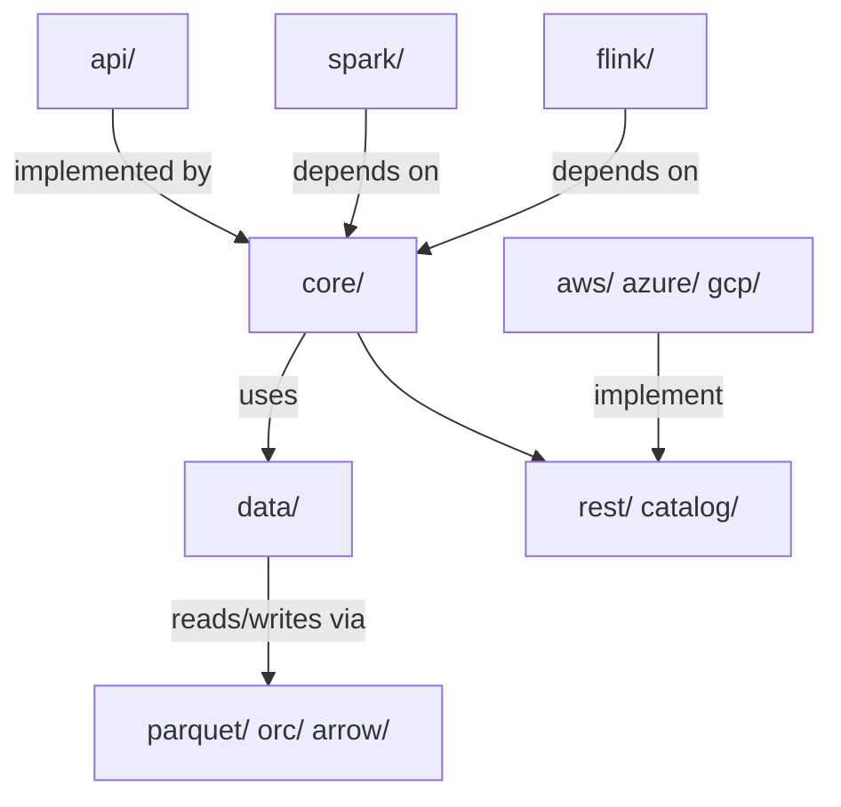
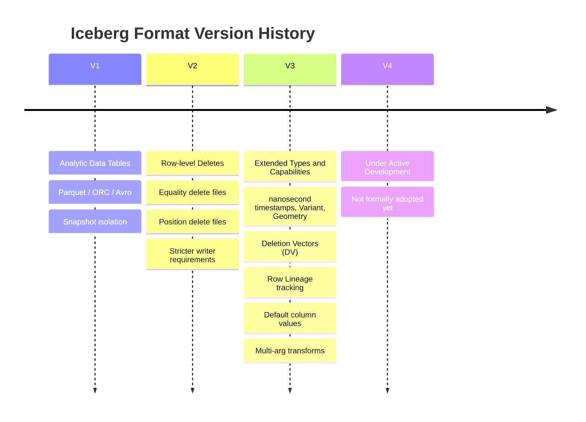
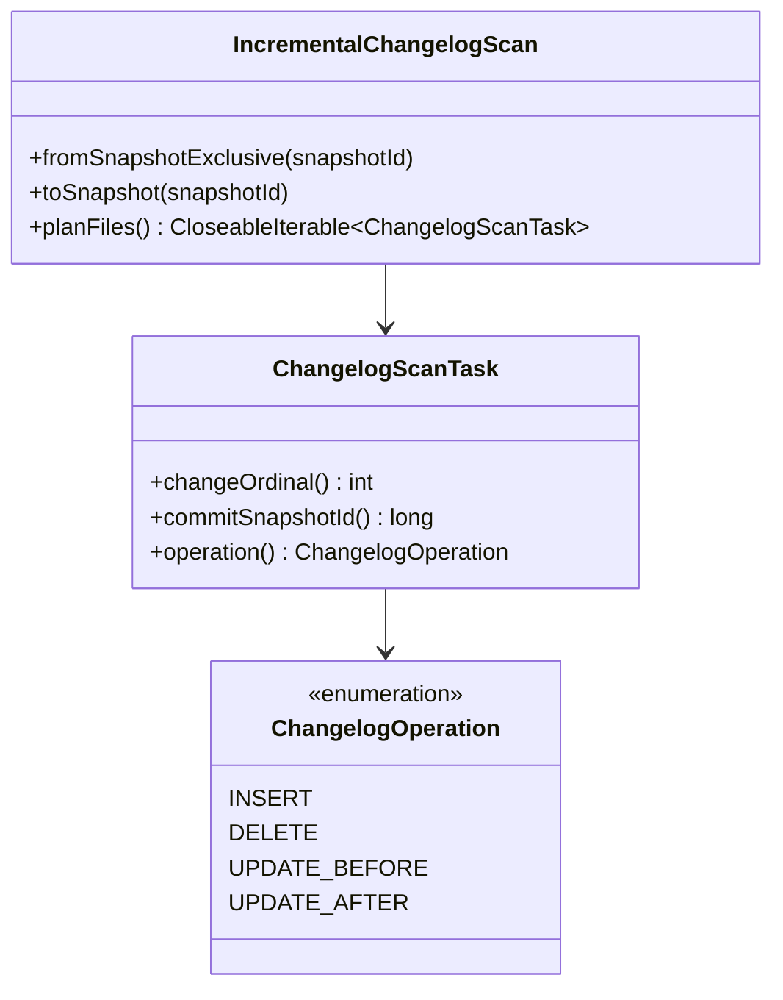
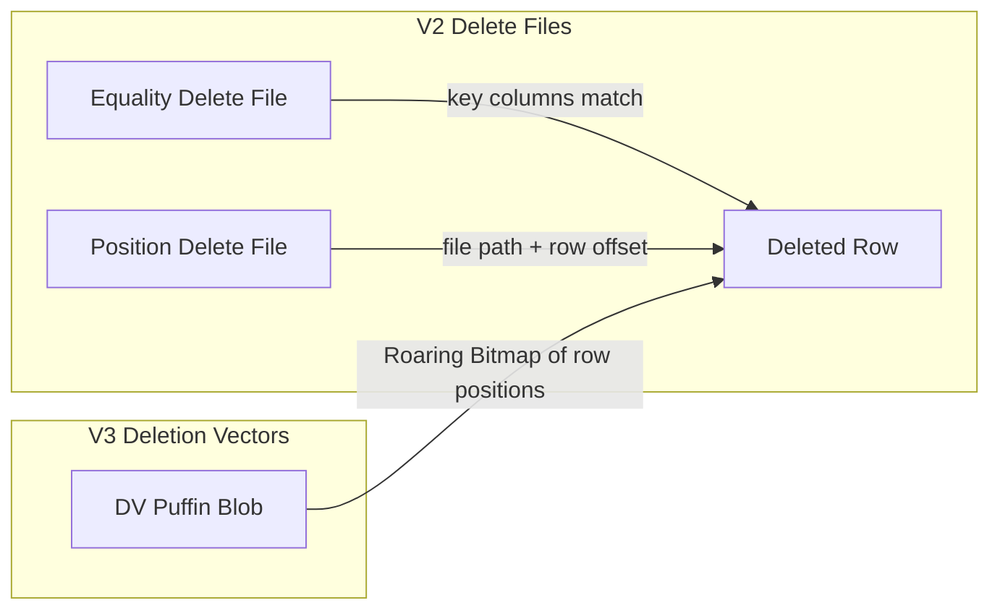
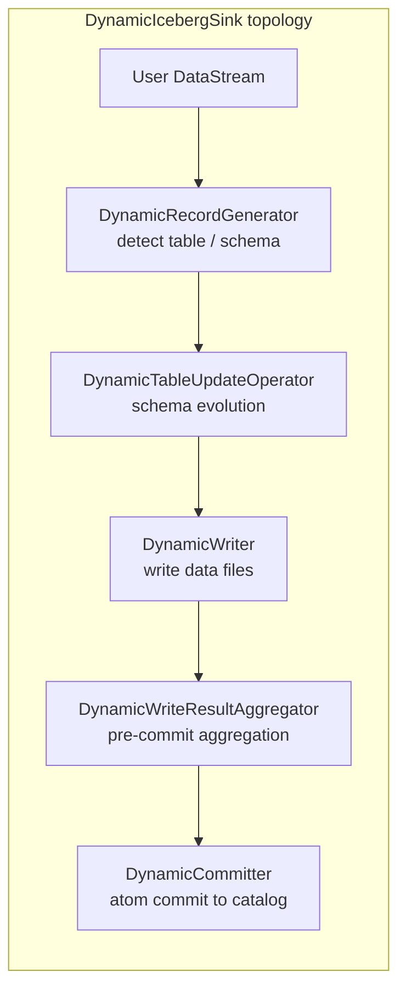
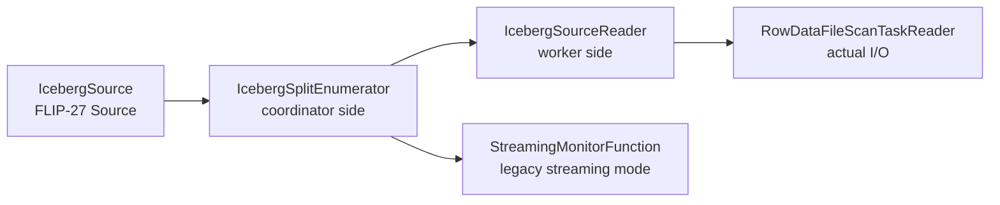
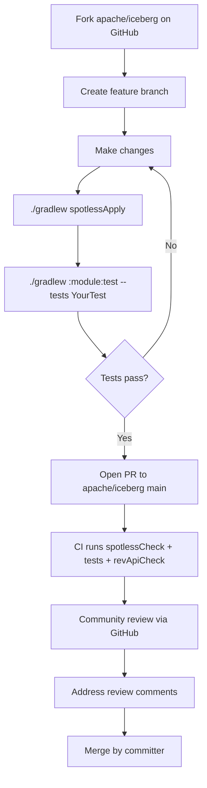

<!--
  Licensed to the Apache Software Foundation (ASF) under one
  or more contributor license agreements.  See the NOTICE file
  distributed with this work for additional information
  regarding copyright ownership.  The ASF licenses this file
  to you under the Apache License, Version 2.0 (the
  "License"); you may not use this file except in compliance
  with the License.  You may obtain a copy of the License at

    http://www.apache.org/licenses/LICENSE-2.0

  Unless required by applicable law or agreed to in writing,
  software distributed under the License is distributed on an
  "AS IS" BASIS, WITHOUT WARRANTIES OR CONDITIONS OF ANY
  KIND, either express or implied.  See the License for the
  specific language governing permissions and limitations
  under the License.
-->

# Apache Iceberg Contributor's Deep Dive

> A guide for experienced table-format engineers getting oriented in the Iceberg Java codebase.

---

## 1. Repository Structure

```
iceberg/
├── api/            ← Public Java interfaces (Table, Scan, Schema, PartitionSpec…)
├── core/           ← Spec implementation — the heart of Iceberg
├── data/           ← Generic data layer (readers / writers, DeleteFilter)
├── parquet/        ← Parquet reader / writer integration
├── orc/            ← ORC reader / writer integration
├── arrow/          ← Arrow / vectorized reader integration
├── spark/          ← Apache Spark integration (v3.4, v3.5, v4.0, v4.1)
├── flink/          ← Apache Flink integration (v1.20, v2.0, v2.1)
├── open-api/       ← OpenAPI spec for the REST Catalog (IRC)
├── aws/            ← AWS-specific catalog + S3FileIO
├── azure/          ← Azure ADLS catalog + ADLSFileIO
├── gcp/            ← GCS catalog + GCSFileIO
├── nessie/         ← Nessie catalog
├── hive-metastore/ ← Hive Metastore catalog
├── kafka-connect/  ← Kafka Connect sink
├── format/         ← The canonical Iceberg spec markdown (spec.md, puffin-spec.md …)
└── docs/           ← Website source
```

### 1.1 Key Layer Boundaries



**`api/`** has the strongest stability guarantees — breaking changes are never allowed. Every other engine and catalog depends on it. New interface methods must always include a default implementation.

**`core/`** implements the table spec. It must remain engine-agnostic. No Spark or Flink imports live here. Everything from snapshot production (`MergingSnapshotProducer`) to manifest reading (`ManifestGroup`) to scan planning (`SnapshotScan`) to delete file handling (`deletes/`) lives here.

### 1.2 Core sub-packages

| Package | What lives there |
|---|---|
| `core/…/iceberg` | `TableMetadata`, `MergingSnapshotProducer`, scan implementations |
| `core/…/deletes` | DV writer, equality/position delete writers, `RoaringPositionBitmap` |
| `core/…/puffin` | Statistics / index files (Puffin format) |
| `core/…/rest` | REST catalog client |
| `core/…/expressions` | Predicate expression tree + evaluators |
| `core/…/io` | `FileIO` abstraction, `CloseableIterable`, task writers |
| `core/…/variants` | Variant type support (V3+) |
| `core/…/encryption` | Table encryption key management |
| `core/…/metrics` | Scan / commit metrics reporting |

### 1.3 Spark module layout

```
spark/
├── v3.4/  ← Spark 3.4
├── v3.5/  ← Spark 3.5
├── v4.0/  ← Spark 4.0
└── v4.1/  ← Spark 4.1
    └── spark/src/main/java/…/spark/
        ├── source/   ← DataSourceV2 table, reader, writer
        ├── actions/  ← RewriteDataFiles, ExpireSnapshots, RewriteManifests …
        ├── procedures/ ← SQL stored procedures (CALL iceberg.system.…)
        └── functions/  ← SQL scalar functions (bucket, truncate, …)
```

### 1.4 Flink module layout

```
flink/
├── v1.20/
├── v2.0/
└── v2.1/
    └── flink/src/main/java/…/flink/
        ├── sink/           ← IcebergSink (v1), IcebergFilesCommitter
        │   ├── dynamic/    ← DynamicIcebergSink (multi-table, schema-evolving sink)
        │   └── shuffle/    ← Range partition statistics for sort-on-write
        ├── source/         ← IcebergSource (FLIP-27), streaming monitor
        │   └── reader/     ← Split readers, batcher, watermark extractor
        ├── maintenance/    ← Table maintenance pipelines (compaction, orphan cleanup)
        ├── data/           ← RowData ↔ Iceberg record converters
        └── actions/        ← Flink-backed rewrite actions
```

---

## 2. Local Development

### 2.1 Prerequisites

| Tool | Version |
|---|---|
| JDK | 11 or 17 (17 recommended) |
| Gradle | Wrapper included (`./gradlew`), no install needed |
| Docker (optional) | For REST catalog integration tests |

No Maven. No IDE plugins required. The standard workflow is:

```bash
# Clone and build (skip all tests for a fast first build)
./gradlew build -x test -x integrationTest

# Format code before committing (Spotless is enforced by CI)
./gradlew spotlessApply

# Check formatting only
./gradlew spotlessCheck

# Check API compatibility (revapi tracks breaking changes)
./gradlew revApiCheck
```

### 2.2 Running Tests

Tests are per-module and use JUnit 5 + AssertJ.

```bash
# Run a single test class in core
./gradlew :iceberg-core:test --tests org.apache.iceberg.TestTableMetadata

# Run a single test method
./gradlew :iceberg-core:test --tests "org.apache.iceberg.TestTableMetadata.testJsonSerialization"

# Run Spark tests (module name includes Spark + Scala version)
./gradlew :iceberg-spark:iceberg-spark-4.0_2.13:test \
  --tests "org.apache.iceberg.spark.source.TestSparkReaderDeletes"

# Run Flink tests
./gradlew :iceberg-flink:iceberg-flink-2.0:test \
  --tests "org.apache.iceberg.flink.sink.TestIcebergSink"

# Run all Flink tests
./gradlew :iceberg-flink:iceberg-flink-2.0:test
```

### 2.3 Project Conventions Cheat-Sheet

```java
// ✅ Correct — no Jackson annotations, use custom parsers
class MyMetadataParser {
  static void toJson(MyMetadata meta, JsonGenerator generator) { … }
  static MyMetadata fromJson(JsonNode node) { … }
}

// ✅ Correct — null over Optional, Preconditions first
public MyObject create(String name, Schema schema) {
  Preconditions.checkNotNull(name, "Name cannot be null");
  Preconditions.checkNotNull(schema, "Schema cannot be null");
  …
}

// ✅ Correct — CloseableIterable, not Stream
try (CloseableIterable<FileScanTask> tasks = scan.planFiles()) {
  for (FileScanTask task : tasks) { … }
}

// ✅ Correct — kebab-case JSON keys
{"format-version": 2, "table-uuid": "...", "last-updated-ms": 1234}
```

---

## 3. Areas of Deep Interest

### 3.1 Spec Version Roadmap



### 3.2 CDC / Changelog

The changelog machinery is already built into the API layer. The core abstraction is an **incremental scan** that returns change events between two snapshots.



Key files:
- `api/…/IncrementalChangelogScan.java` — the top-level scan API
- `api/…/ChangelogScanTask.java` — one scan task (maps to a file slice)
- `core/…/ChangelogUtil.java` — helper logic
- Open PR #10935 — **Changelog scan support for tables with delete files** (long-running, this is hard)

**SCD Type 2 / Upsert** — Iceberg itself is append-only + deletes. SCD-2 is implemented at the engine layer (Flink `EqualityFieldKeySelector` routes by primary key, Spark `MERGE INTO`) on top of Iceberg's V2 delete machinery. Iceberg doesn't natively track "current version" rows — that logic must live in the writer.

### 3.3 Delete Files and Deletion Vectors (V3)



Deletion Vectors (DVs) are the V3 evolution of position deletes. A DV is stored as a Puffin blob using a `RoaringBitmap` and replaces multiple small position delete files per data file with a single compact bitmap.

Key files:
- `core/…/deletes/DVFileWriter.java` — DV writer interface
- `core/…/deletes/BitmapPositionDeleteIndex.java` — bitmap-backed index
- `core/…/deletes/RoaringPositionBitmap.java` — the bitmap itself
- `core/…/puffin/` — Puffin container for statistics and DV blobs

### 3.4 Puffin — Statistics / Indexing Files

Puffin is Iceberg's container format for auxiliary data: column statistics (NDV sketches, histograms) and deletion vectors. Think of it as a sidecar file format.

```
Puffin File Layout:
┌─────────────┬─────────────┬─── … ───┬───────────────┬──────────┐
│ Magic bytes │  Blob 1     │ Blob N  │ Footer (JSON) │ Magic    │
│ (4 bytes)   │  (raw bytes)│         │ + footer size │ (4 bytes)│
└─────────────┴─────────────┴─── … ───┴───────────────┴──────────┘
```

- `core/…/puffin/Puffin.java` — read/write builder
- `core/…/puffin/PuffinFormat.java` — compression/decompression (has live LZ4 bug — see §7)
- `core/…/puffin/StandardBlobTypes.java` — registered blob type names (`apache-datasketches-theta-v1`, `deletion-vector-v1`)
- `format/puffin-spec.md` — the canonical spec

### 3.5 Format V4 — What's Coming

V4 is **under active development and not yet formally adopted** (per `format/spec.md` line 29). No public release has included V4 tables. V4 work to watch:

- **Catalog transactions** — PR #6948 (very long-running): atomic multi-table operations
- **Geometry / Geography** — PR #12347: adding spatial types to the spec
- **Scan planning APIs on REST** — PR #11180: pushing planning server-side
- **File Format API unification** — PR #12216

Keep an eye on the `format/spec.md` Appendix E section for the formal V4 changelog as it solidifies.

---

## 4. Streaming with Iceberg (Flink)

### 4.1 Sink Architecture



- **`FlinkSink`** (v1, legacy): uses `IcebergFilesCommitter`, a stateful operator that holds pending manifests across checkpoints using Flink managed state.
- **`IcebergSink`** (v2): uses Flink's `TwoPhaseCommittingSink` (FLIP-143). More idiomatic to Flink's new sink API.
- **`DynamicIcebergSink`**: multi-table sink that can route records to different Iceberg tables, auto-create tables, and evolve schemas. It adds a `DynamicRecordGenerator` → `DynamicTableUpdateOperator` in front of the writer topology.

### 4.2 Source Architecture



Streaming reads work by periodically discovering new snapshots and emitting `FileScanTask` splits for new data files. The `ScanContext` carries `startSnapshotId` and `endSnapshotId` for incremental reads.

### 4.3 Table Maintenance Pipelines

The `flink/…/maintenance/` package contains `TableMaintenance`, a Flink streaming job that can continuously run:
- Compaction (rewrite small files)
- Orphan file cleanup
- Snapshot expiry

This is relatively new (1.6+) and still evolving.

---

## 5. Current Community Activity

Based on open PRs and issues, the major themes in flight are:

| Theme | Key PRs / Issues |
|---|---|
| **REST Catalog (IRC) Events** | #13580–13582: request/response objects, server handlers, test harness |
| **Catalog Transactions** | #6948: long-running, adds `CatalogTransaction` API to `core` |
| **Deletion Vector Rewrite** | #12403: separate Spark action to rewrite DV files; #15924: stream DV rewrite to reduce memory |
| **Changelog scan + delete files** | #10935: incremental changelog scan for tables with equality deletes (complex) |
| **Geometry / Geography types** | #12347: Parquet R/W for new V3 spatial types |
| **ResolvingFileIO as default** | #8272: replaces `HadoopFileIO` as the default, enabling cloud-native deployments |
| **DynamicIcebergSink stability** | #16128: UID non-determinism (savepoint/recovery break); #16008: dedup race condition |
| **JUnit4 → JUnit5 migration (Flink)** | #12937: good first issue, mechanical cleanup |
| **Adaptive scan parallelism** | #15988: bug where shuffle-partition count causes over-aggressive scaling |
| **S3 / GCS thread leaks** | #15898: `CachingCatalog` doesn't close `FileIO` on eviction |

---

## 6. Suggested Starter Bugs

These are confirmed bugs with clearly identified root causes, minimal blast radius, and no contested design questions. All are unassigned as of late April 2026.

---

### Bug 1 — `StructProjection` drops `allowMissing` for nested structs

**Issue:** [#16123](https://github.com/apache/iceberg/issues/16123)  
**Module:** `api`  
**Difficulty:** ⭐ (trivial, one-line fix + test)

**What's wrong:**  
`StructProjection.createAllowMissing()` constructs nested `StructProjection` instances without forwarding the `allowMissing` flag. Optional fields in nested structs throw `IllegalArgumentException` instead of being projected as `null`.

```java
// core/…/util/StructProjection.java  ~line 123
case STRUCT:
    nestedProjections[pos] =
        new StructProjection(
            dataField.type().asStructType(),
            projectedField.type().asStructType());
    // ❌ allowMissing is silently dropped for nested structs
    break;
```

**Fix:**  
Pass `allowMissing` to the nested constructor:
```java
new StructProjection(
    dataField.type().asStructType(),
    projectedField.type().asStructType(),
    allowMissing);   // ← add this
```

**Test to add:** A test in `TestStructProjection` that creates a schema with a nested struct containing an optional field, projects it with `createAllowMissing`, and asserts the missing field is `null` (not an exception).

---

### Bug 2 — Puffin LZ4 footer compression throws at runtime

**Issue:** [#16033](https://github.com/apache/iceberg/issues/16033)  
**Module:** `core` (puffin)  
**Difficulty:** ⭐⭐ (small, but touches compression plumbing)

**What's wrong:**  
`PuffinFormat.FOOTER_COMPRESSION_CODEC` is set to `LZ4`, and calling `Puffin.write(file).compressFooter()` causes an `UnsupportedOperationException` deep in the write path:

```java
// PuffinFormat.java ~line 86
static final PuffinCompressionCodec FOOTER_COMPRESSION_CODEC = PuffinCompressionCodec.LZ4;

// …line 110
case LZ4:
    // TODO requires LZ4 frame compressor
    // https://github.com/airlift/aircompressor/pull/142  ← this PR is now MERGED
    break;
// falls through to:
throw new UnsupportedOperationException("Unsupported codec: " + codec);
```

**Fix options (pick one):**
1. Implement LZ4 frame compress/decompress using `aircompressor` (the upstream PR was merged).
2. Short-term: throw an `UnsupportedOperationException` from `Puffin.WriteBuilder.compressFooter()` with a clear message, rather than failing silently deep in the write path.

The issue author indicated they can contribute option 1.

---

### Bug 3 — Parquet filter pushdown throws for decimal/UUID predicates

**Issue:** [#16035](https://github.com/apache/iceberg/issues/16035)  
**Module:** `parquet`  
**Difficulty:** ⭐⭐ (touches Parquet type encoding)

**What's wrong:**  
`ParquetFilters.getParquetPrimitive()` handles `Number`, `CharSequence`, and `ByteBuffer`, but not `BigDecimal` (Iceberg decimal type) or `UUID`. Predicates on these column types throw instead of gracefully skipping pushdown:

```java
// ParquetFilters.java ~line 223
// TODO: this needs to convert to handle BigDecimal and UUID
if (value instanceof Number) { … }
else if (value instanceof CharSequence) { … }
else if (value instanceof ByteBuffer) { … }
// else: falls through to UnsupportedOperationException
```

**Fix:**  
- `BigDecimal` → encode as fixed-length `Binary` (unscaled value, big-endian)
- `UUID` → encode as 16-byte `Binary`
- Or: return `null` to skip pushdown gracefully (safer short-term fix)

This is a good bug to pair with writing a test that filters on a decimal column and verifies no exception is thrown.

---

### Bug 4 — Flink `DynamicIcebergSink` non-deterministic operator UID breaks savepoint recovery

**Issue:** [#16128](https://github.com/apache/iceberg/issues/16128)  
**Module:** `flink` (all supported versions)  
**Difficulty:** ⭐⭐ (streaming expertise directly applicable)

**What's wrong:**  
`DynamicIcebergSink` embeds a per-JVM `UUID.randomUUID()` into the `.uid()` of the pre-commit aggregator operator. Every cold JVM start generates a different operator UID, breaking Flink savepoint / `last-state` recovery:

```java
// DynamicIcebergSink.java
this.sinkId = UUID.randomUUID().toString();   // non-deterministic per JVM

// in addPreCommitTopology():
.uid(prefixIfNotNull(uidPrefix, sinkId + "-pre-commit-topology"))  // ❌ non-deterministic
```

All other operators (generator, updater, writer, committer) use deterministic suffix patterns. Only the pre-commit aggregator mixes in the random `sinkId`.

**Impact:** Any `DynamicIcebergSink` user running with `upgradeMode: last-state` on Flink K8s Operator or using manual savepoints hits `IllegalStateException` on redeploy under unaligned checkpoints + parallelism > 1.

**Fix:**  
Remove `sinkId` from the pre-commit-topology `.uid(...)` — use the same deterministic suffix pattern as all other operators. The `sinkId` can remain for the committer's thread-pool naming, which is the only place it's actually needed:

```java
// Before (broken):
.uid(prefixIfNotNull(uidPrefix, sinkId + "-pre-commit-topology"))

// After (fixed):
.uid(prefixIfNotNull(uidPrefix, "-pre-commit-topology"))
```

This bug exists in all three supported Flink versions (`v1.20`, `v2.0`, `v2.1`) — the fix must be applied to all three. Add a test that asserts `operatorUIDs(build()) == operatorUIDs(build())` across two separate `DynamicIcebergSink` constructions with the same `uidPrefix`.

This is an excellent first streaming bug to fix — it directly exercises your knowledge of Flink state management, checkpoints, and operator topology.

---

## 7. Contribution Workflow



**PR title convention:** `Module: Short description` — e.g.:
- `API: Fix StructProjection allowMissing propagation to nested structs`
- `Core: Implement Puffin LZ4 footer compression using aircompressor`
- `Parquet: Fix UnsupportedOperationException for decimal/UUID filter pushdown`
- `Flink: Fix DynamicIcebergSink non-deterministic operator UID`

**Community channels:**
- GitHub Issues — file a new issue before starting any non-trivial work
- [Apache Iceberg Slack](https://apache-iceberg.slack.com) — `#dev` channel for design questions
- [Dev mailing list](dev@iceberg.apache.org) — for large proposals / spec changes

---

## 8. Where Streaming Expertise Adds the Most Value

Given your background in streaming and CDC (similar to Delta Lake's streaming ingestion), the highest-leverage areas in Iceberg are:

| Area | Maturity | Opportunity |
|---|---|---|
| `DynamicIcebergSink` correctness | Active bugs | Fix #16128 (UID), #16008 (dedup race) |
| Changelog scan + delete files | In-progress | PR #10935 needs more contributors |
| Table Maintenance pipelines | Relatively new | `flink/…/maintenance/` is sparse on tests |
| Exactly-once semantics documentation | Gap | There's no single doc explaining the commit protocol end-to-end |
| `IcebergSource` watermarks | Niche | `ColumnStatsWatermarkExtractor` could use more column type coverage |
| Streaming CDC to SCD-2 patterns | Documentation gap | No official guide connects Iceberg V2 deletes → Flink → SCD-2 output |

The Flink `DynamicIcebergSink` is the most active area of streaming development in the project right now, and bugs like #16128 are well-scoped enough to get your first PR merged quickly while learning the codebase deeply.
